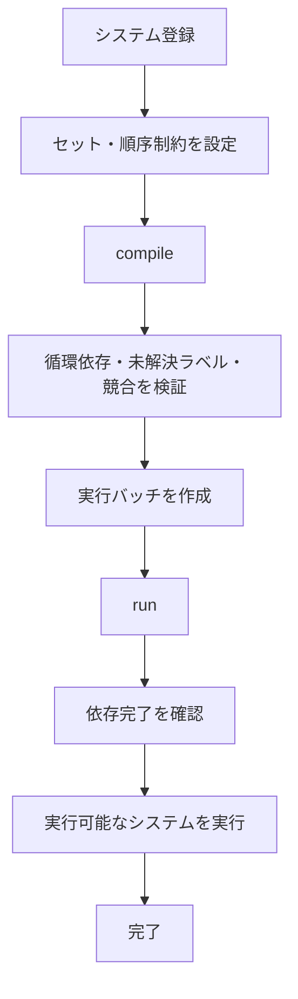

# Scheduler {#Scheduler}

## 概要

Scheduler は依存関係のある関数群を登録し、実行可能な順序へコンパイルしてから実行するための仕組みです。

主な用途は ECS のシステム実行ですが、Core の汎用タスクグラフとしても使えるように、ECS 固有の型には依存しません。ECS 連携では `World&` や `SystemContext&` などをテンプレート引数で渡し、システム関数はその引数を受け取って実行します。

設計方針は以下です。

- Taskflow のように `emplace` で `Task` オブジェクトを作り、`precede` / `succeed` で依存関係を記述できる。
- Bevy Engine のように `Schedule`、`SystemSet`、`chain` を使って ECS システムの実行順を簡潔に表現できる。
- 依存関係がないシステムは並列実行できる。
- 明示されていない順序には依存しない。順序が重要な場合は必ず依存関係またはセット順序で表現する。
- コンパイル時に循環依存、未解決ラベル、重複ラベルを検出できる。
- システム間依存は文字列ではなく `Task` オブジェクトで指定し、名前変更に強い記述にする。

## 参考にする機能

### Taskflow 由来の機能

- タスクをノード、依存関係をエッジとする DAG を構築する。
- `precede` / `succeed` 相当の API で前後関係を記述する。
- `placeholder` 相当の空ノードを作り、あとから処理や名前を設定できる。
- サブグラフを 1 ノードとして合成できる。
- Executor がワーカースレッドで実行し、完了待機できる。
- プロファイルや可視化用にグラフ情報を出力できる。

### Bevy 由来の機能

- `Schedule` はシステム、セット、順序制約を保持する。
- `SystemSet` は複数システムへ共通の順序制約を適用する。
- `chain` は登録順に依存関係を張る簡易 API として提供する。
- 明示された依存関係と排他制約から並列実行できるタスクを決定する。
- シングルスレッド実行とマルチスレッド実行を切り替えられる。

## 機能要件

### システム登録

- 任意の callable をシステムとして登録できる。
- システムには名前、ラベル、セット、排他制約、実行スレッド指定を付与できる。
- 複数システムをまとめて登録できる。
- 登録 API は ECS で頻繁に使っても読みやすい記述にする。

```cpp
Schedule<World&> schedule;

auto taskA = schedule.emplace(SystemA)
	.name("SystemA");

auto taskB = schedule.emplace(SystemB)
	.name("SystemB");

taskA.precede(taskB);
```

### 順序制御

- `Task::precede` で、このタスクを指定タスクより前に実行する制約を追加できる。
- `Task::succeed` で、このタスクを指定タスクより後に実行する制約を追加できる。
- `chain` で複数システムを直列化できる。
- セット同士の順序制約は `ScheduleSet` ハンドルで指定できる。
- 文字列ラベルによるシステム間依存は提供しない。
- 依存関係がないシステム同士の実行順は未定義とする。

```cpp
auto taskA = schedule.emplace(SystemA);
auto taskB = schedule.emplace(SystemB);
auto taskC = schedule.emplace(SystemC);

taskA.precede(taskB, taskC); // taskA は taskB と taskC より前
taskC.succeed(taskB);        // taskC は taskB より後

schedule.chain(taskA, taskB, taskC);

auto A = schedule.emplace(SystemA);
auto B = schedule.emplace(SystemB);
auto C = schedule.emplace(SystemC);
auto D = schedule.emplace(SystemD);

A.precede(B, C); // A は B と C より前
D.succeed(B, C); // D は B と C より後
```

### セット

- セットはシステムのグループであり、共通の順序制約と実行ポリシーを持つ。
- 1 つのシステムは複数セットに所属できる。
- セットは階層化できる。
- セットに対する `precede` / `succeed` は所属システム全体に展開される。

```cpp
auto setA = schedule.configureSet("SetA");
auto setB = schedule.configureSet("SetB");
auto setC = schedule.configureSet("SetC");

setA.precede(setB);
setC.succeed(setB);

schedule.emplace(SystemB)
	.inSet(setB)
	.inSet(schedule.configureSet("FixedStep"));
```

### 並列実行

- 依存関係と排他制約がないシステムは並列実行できる。
- 実行方式は `ExecutorKind::SingleThreaded` と `ExecutorKind::MultiThreaded` を選択できる。
- メインスレッドでのみ実行できるシステムを指定できる。
- Scheduler 専用の `ScheduleExecutor` / `WorkerPool` を用意し、ECS の実行特性に合わせて制御できる。
- ワーカースレッド数は `ScheduleExecutorConfig` で指定できる。未指定の場合はハードウェア並列数を基準に決定する。

```cpp
schedule.setExecutorKind(ExecutorKind::MultiThreaded);

schedule.emplace(UpdateWindow)
	.name("UpdateWindow")
	.mainThread();
```

### 排他制約

- Scheduler は ECS のデータ構造を解析しない。
- 並列実行させたくないシステムには、明示的な排他タグを付与できる。
- 同じ排他タグを持つシステム同士は同時実行しない。
- 排他タグは実行順を保証しない。順序が必要な場合は `precede` / `succeed` / `chain` を使う。
- すべてのシステムと同時実行させたくない場合は `exclusive()` を指定できる。

```cpp
auto movement = schedule.emplace(UpdateMovement)
	.conflict("WorldMutation");

auto taskB = schedule.emplace(SystemB)
	.conflict("WorldMutation");

movement.precede(taskB);
```

### サブスケジュールと合成

- `Schedule` を別の `Schedule` の 1 ノードとして合成できる。
- 合成されたスケジュールは親から見ると 1 つの依存ノードとして扱う。
- スケジュールの分割単位は Core では定義しない。Engine や App などの上位モジュールが用途に応じて定義する。

```cpp
Schedule<World&> scheduleA("ScheduleA");
Schedule<World&> scheduleB("ScheduleB");

Schedule<World&> main("Main");
auto taskA = main.compose(scheduleA).name("ScheduleA");
auto taskB = main.compose(scheduleB).name("ScheduleB");

taskA.precede(taskB);
```

### 診断と可視化

- `compile()` は診断結果を返す。
- 循環依存、未解決ラベル、重複ラベル、到達不能ノードを検出する。
- Graphviz DOT または JSON 形式でグラフを出力できる。
- 実行時間、待機時間、実行スレッドをプロファイルできる。

```cpp
auto result = schedule.compile();
if (!result) {
	for (const auto& error : result.errors()) {
		LOG_ERROR("Scheduler", error.message);
	}
}

schedule.dumpDot("Schedule.dot");
schedule.enableProfiler(true);
```

## 実装要件

- C++20 で実装する。
- `Schedule` はテンプレートクラスとして実行引数を型で保持する。
- 実行時の動的割り当ては登録・コンパイル時に寄せ、`run()` 中の割り当てを最小化する。
- コンパイル後の `run()` は同じグラフを毎フレーム再利用できる。
- `compile()` 後に登録内容を変更した場合は dirty 状態になり、次回 `run()` 前に再コンパイルが必要になる。
- 並列実行は Scheduler 専用の軽量 Executor を利用する。
- public メソッドには日本語の Doxygen コメントを付ける。
- 例外を投げる API と `Result` を返す API の使い分けを明確にする。基本は `compile()` が `ScheduleBuildResult` を返し、`run()` は未コンパイルやコンパイル失敗時に例外を投げる。

## 基本設計

### 主要クラス

```cpp
namespace Amuse {

enum class ExecutorKind {
	SingleThreaded,
	MultiThreaded,
};

struct ScheduleExecutorConfig {
	s32 workerCount = 0;
	bool allowWorkerSleep = true;
	bool enableWorkStealing = true;
};

enum class ScheduleBuildLogLevel {
	Ignore,
	Warn,
	Error,
};

class Task;
class ScheduleSet;
class ScheduleBuildResult;
class ScheduleProfiler;
class ScheduleExecutor;

template<class... Args>
class Schedule;

}
```

### データ構造

```cpp
Schedule
  Vector<SystemNode>       systems
  Vector<SetNode>          sets
  Vector<Edge>             explicitEdges
  Vector<Edge>             compiledEdges
  Vector<ExecutionBatch>   batches
  ScheduleBuildSettings    buildSettings
  ExecutorKind             executorKind
  ScheduleExecutor*        executor

SystemNode
  SystemId                 id
  String                   name
  Vector<Label>            labels
  Vector<SetId>            sets
  Vector<ConflictTag>      conflicts
  ThreadAffinity           affinity
  Function                 invoker

SetNode
  SetId                    id
  Label                    label
  Vector<SetId>            parents
  Vector<Edge>             edges

ExecutionBatch
  Vector<SystemId>         systems
  bool                     requiresMainThread
```

### 実行フロー



### 最小 API 例

```cpp
void SystemA(World& world);
void SystemB(World& world);
void SystemC(World& world);
void SystemD(World& world);

int main() {
	using WorldSchedule = Schedule<World&>;

	WorldSchedule schedule("Update");

	auto taskA = schedule.emplace(SystemA).name("SystemA");
	auto taskB = schedule.emplace(SystemB).name("SystemB");
	auto taskC = schedule.emplace(SystemC).name("SystemC");
	auto taskD = schedule.emplace(SystemD).name("SystemD");

	taskA.precede(taskB);
	taskB.precede(taskD);
	schedule.chain(taskA, taskC, taskD);

	World world;

	auto result = schedule.compile();
	if (!result) {
		return 1;
	}

	schedule.run(world);
	return 0;
}
```

### 上位モジュールでの利用例

```cpp
Schedule<World&> schedule("Main");

auto setA = schedule.configureSet("SetA");

auto setB = schedule.configureSet("SetB");

auto setC = schedule.configureSet("SetC");
auto setD = schedule.configureSet("SetD");

setA.precede(setB);
setB.precede(setC);
setC.precede(setD);

schedule.addSystems(setA,
	SystemA1,
	SystemA2,
	SystemA3
);

schedule.addSystems(setB,
	SystemB1,
	SystemB2,
	SystemB3
);

schedule.addSystems(setC,
	SystemC1,
	SystemC2
).chain();

auto taskD = schedule.emplace(SystemD)
	.inSet(setD)
	.mainThread();

setC.precede(taskD);
```

## 詳細設計

### Schedule

```cpp
template<class... Args>
class Schedule {
public:
	//! @brief スケジュールを作成
	//! @param name 診断とプロファイルで使用する名前
	explicit Schedule(StringView name = {});

	//! @brief システムを登録
	//! @param system 登録する callable
	//! @return 登録したシステムの設定オブジェクト
	template<class F>
	auto emplace(F&& system) -> Task;

	//! @brief 複数システムを登録
	//! @param systems 登録する callable 群
	//! @return 登録したシステム群の設定オブジェクト
	template<class... F>
	auto addSystems(F&&... systems) -> TaskGroup;

	//! @brief 指定セットへ複数システムを登録
	//! @param set 所属先セット
	//! @param systems 登録する callable 群
	template<class... F>
	auto addSystems(const ScheduleSet& set, F&&... systems) -> TaskGroup;

	//! @brief セット設定を取得または作成
	//! @param setName セット名
	//! @details セット名は診断と可視化の表示名にも使用する。
	auto configureSet(StringView setName) -> ScheduleSet;

	//! @brief スケジュールを 1 ノードとして合成
	//! @param child 合成する子スケジュール
	auto compose(Schedule& child) -> Task;

	//! @brief 直列実行制約を追加
	template<class... Nodes>
	void chain(Nodes&&... nodes);

	//! @brief スケジュールを実行可能な形式にコンパイル
	auto compile() -> ScheduleBuildResult;

	//! @brief スケジュールを実行
	//! @param args システムへ渡す引数
	void run(Args... args);

	//! @brief Executor 種別を設定
	void setExecutorKind(ExecutorKind kind);

	//! @brief 並列実行に使用する Executor を設定
	//! @details 未設定の場合はデフォルト Executor を使用する。
	void setExecutor(ScheduleExecutor& executor);

	//! @brief Graphviz DOT 形式でグラフを出力
	bool dumpDot(StringView path) const;
};
```

### ScheduleExecutor

`ScheduleExecutor` は Scheduler 専用のワーカープールです。初期実装では Core の汎用並列基盤として Scheduler と同じ領域に置き、依存関係、排他制約、メインスレッド実行、フレーム単位の待機に合わせて小さく作ります。

```cpp
class ScheduleExecutor {
public:
	//! @brief Executor を作成
	//! @param config ワーカースレッド数などの設定
	explicit ScheduleExecutor(const ScheduleExecutorConfig& config = {});

	//! @brief デストラクタ
	//! @details 実行中のジョブがあれば完了を待って停止する。
	~ScheduleExecutor();

	//! @brief ワーカースレッド数を取得
	auto workerCount() const -> s32;

	//! @brief ジョブを投入
	//! @param action 実行する処理
	void enqueue(Action&& action);

	//! @brief 投入済みジョブの完了を待機
	void wait();

	//! @brief 現在のスレッドがこの Executor のワーカーか判定
	auto isWorkerThread() const -> bool;
};
```

`ScheduleExecutor` は Taskflow の Executor ほど多機能にしません。依存関係とサブグラフは `Schedule` 側のコンパイル済み実行計画で管理し、Executor は ready になった処理を実行するだけにします。

### Task

`Task` は登録済みシステムを指す fluent API 用ハンドルです。システムの所有権は `Schedule` が持つため、`Task` は軽量な参照として扱います。

依存関係は `Task` オブジェクト同士で指定します。文字列名は表示、診断、可視化のために使い、依存解決には使いません。

```cpp
class Task {
public:
	//! @brief 表示名を設定
	auto name(StringView name) -> Task&;

	//! @brief ラベルを追加
	//! @details ラベルは診断や可視化用であり、システム間依存の解決には使わない。
	template<class Label>
	auto label(Label&& label) -> Task&;

	//! @brief セットへ所属させる
	//! @param set 所属先セット
	auto inSet(const ScheduleSet& set) -> Task&;

	//! @brief このタスクを指定タスクより前に実行
	template<class... Tasks>
	auto precede(Tasks&&... tasks) -> Task&;

	//! @brief このタスクを指定タスクより後に実行
	template<class... Tasks>
	auto succeed(Tasks&&... tasks) -> Task&;

	//! @brief 排他タグを追加
	//! @details 同じ排他タグを持つシステム同士は同時実行されない。
	template<class Label>
	auto conflict(Label&& label) -> Task&;

	//! @brief メインスレッド実行を指定
	auto mainThread() -> Task&;

	//! @brief 並列実行を禁止
	auto exclusive() -> Task&;
};
```

### ScheduleSet

```cpp
class ScheduleSet {
public:
	//! @brief 親セットを設定
	//! @param parent 親セット
	auto inSet(const ScheduleSet& parent) -> ScheduleSet&;

	//! @brief このセットを指定セットまたはタスクより前に実行
	template<class... Nodes>
	auto precede(Nodes&&... nodes) -> ScheduleSet&;

	//! @brief このセットを指定セットまたはタスクより後に実行
	template<class... Nodes>
	auto succeed(Nodes&&... nodes) -> ScheduleSet&;

	//! @brief セット内システムの登録順を依存順として扱う
	auto chain() -> ScheduleSet&;
};
```

### ラベルとセット名

システム間依存にはラベルを使わず、`Task` オブジェクトを使います。

セットは `configureSet("Name")` で作成します。セット名は Graphviz DOT / JSON などの可視化でもそのまま表示名として使います。

タスクをセットへ所属させるときは、文字列を再指定せず、`configureSet` が返した `ScheduleSet` オブジェクトを渡します。これにより、タイプミスやリネーム漏れを避けます。

```cpp
auto setA = schedule.configureSet("SetA");
auto setB = schedule.configureSet("SetB");

setA.precede(setB);

schedule.emplace(SystemA).inSet(setA);
schedule.emplace(SystemB).inSet(setB);
```

排他タグと診断用ラベルも `StringView` を主 API とします。型名や列挙値から文字列を自動生成する API は初期実装では提供しません。

名前衝突を避けたい場合は、上位モジュール側で名前空間付きの文字列を使います。

```cpp
auto pluginSet = schedule.configureSet("Physics.PluginSet");
auto outputSet = schedule.configureSet("Render.OutputSet");

schedule.emplace(SystemA).inSet(pluginSet);
```

### コンパイル

`compile()` は以下の順で実行します。

1. システム、セット、ラベルを確定する。
2. セット所属とセット階層を展開する。
3. `precede` / `succeed` / `chain` をエッジへ変換する。
4. 排他タグから並列実行できないペアを計算する。
5. トポロジカルソートで実行順を確定する。
6. 並列実行可能なバッチまたは ready queue 用の依存カウントを構築する。
7. プロファイルと可視化用メタデータを保存する。

### 実行

`ExecutorKind::SingleThreaded` の場合は、コンパイル済み順序に従って 1 つずつ実行します。ただし順序制約がないシステムの相対順は仕様上未定義です。

`ExecutorKind::MultiThreaded` の場合は、依存カウントが 0 で、排他制約がないシステムを `ScheduleExecutor` に投入します。メインスレッド指定のシステムはワーカーに投入せず、メインスレッド側で依存完了後に実行します。

状態によって処理を行わない分岐は Scheduler では扱いません。システム関数内で状態を確認して早期 `return` します。

### エラーハンドリング

```cpp
enum class ScheduleBuildErrorType {
	DuplicateLabel,
	UnresolvedLabel,
	DependencyCycle,
	InvalidSetHierarchy,
};

struct ScheduleBuildError {
	ScheduleBuildErrorType type;
	String message;
	Vector<String> nodes;
};

class ScheduleBuildResult {
public:
	explicit operator bool() const;
	auto errors() const -> Span<const ScheduleBuildError>;
	auto warnings() const -> Span<const ScheduleBuildWarning>;
};
```

## ビルド設定

```cpp
struct ScheduleBuildSettings {
	ScheduleBuildLogLevel unresolvedLabel = ScheduleBuildLogLevel::Error;
	ScheduleBuildLogLevel dependencyCycle = ScheduleBuildLogLevel::Error;
	bool validateConflictTag = true;
	bool stableTopologicalSort = true;
};
```

- `stableTopologicalSort` が true の場合、依存関係が同じノードの並びは登録順で安定化する。ただし仕様として順序を保証したい場合は `precede` / `succeed` / `chain` を使う。

## 上位モジュールとの関係

Core Scheduler は、スケジュール名や更新フェイズを固定値として持ちません。これらは Engine / App / Editor などの上位モジュールが定義します。

上位モジュールは、必要に応じて以下のようなスケジュール識別用の型を定義して Core Scheduler に渡します。

```cpp
struct MainSchedule;
struct BackgroundSchedule;
struct CustomSchedule;
```

Core はこれらの意味を解釈しません。実行タイミングや固定時間ステップとの対応は上位モジュール側で管理します。

### プラグイン向け API

プラグインは自分のセットを公開し、他プラグインが順序制約を追加できるようにします。

```cpp
struct ExamplePlugin {
	struct PluginSet;
	struct BaseSet;
	struct OutputSet;
	struct MainSchedule;

	void build(App& app) {
		auto pluginSet = app.configureSet<MainSchedule>("Example.PluginSet");
		auto baseSet = app.configureSet<MainSchedule>("Example.BaseSet");
		auto outputSet = app.configureSet<MainSchedule>("Example.OutputSet");

		pluginSet.succeed(baseSet);
		pluginSet.precede(outputSet);

		app.addSystems<MainSchedule>(pluginSet,
			PluginSystemA,
			PluginSystemB,
			PluginSystemC
		).chain();
	}
};
```

### OneShot

イベントやロード完了待ちのように 1 回だけ実行したい処理は、システム内部の状態で制御します。

```cpp
void ShowLoadedMessage(World& world) {
	if (!world.isLevelLoaded()) return;
	if (world.hasShownLoadedMessage()) return;

	world.showLoadedMessage();
	world.setShownLoadedMessage(true);
}
```

Scheduler は OneShot 用の特別な API を持ちません。

## 実装上の注意点

- `Schedule` は登録フェーズと実行フェーズを明確に分ける。`run()` 中のシステム追加・削除は初期実装では非対応にする。
- 実行中にシステムを有効・無効化したい場合は、システム関数内で状態を確認して早期 `return` する。
- システム関数が例外を投げた場合は、そのフレームのスケジュール実行を中断し、例外を呼び出し元へ伝播する。並列実行中は最初の例外を保持し、実行中ジョブの完了を待ってから再送出する。
- `exclusive()` は他のすべてのシステムと排他になるものとして扱い、並列実行しない。
- `mainThread()` はスレッド親和性だけを表す。順序制約ではないため、必要な前後関係は別途指定する。
- 同じラベルを複数システムに付けたい場合は `allowMultiple()` のような明示 API を検討する。初期実装では重複ラベルを警告にする。
- `placeholder` は循環参照や初期化順問題を避けるために便利だが、未設定 placeholder は `compile()` でエラーにする。
- プロファイル情報は Debug ビルドまたは明示有効時のみ収集する。

## 実装ステップ

1. `Schedule`、`Task`、`ScheduleSet`、ラベル解決、`precede` / `succeed` / `chain` を実装する。
2. `compile()` でトポロジカルソート、循環依存、未解決ラベルを検出する。
3. `SingleThreaded` 実行を実装する。
4. `ScheduleExecutor` / `WorkerPool` を使った `MultiThreaded` 実行を実装する。
5. 排他タグと排他制約を実装する。
6. DOT / JSON 出力とプロファイルを実装する。

## 単体テスト

Core-test に以下を追加します。

- 依存関係がトポロジカル順に実行される。
- `chain` が登録順に依存エッジを張る。
- 循環依存を検出できる。
- 未解決ラベルを検出できる。
- セット順序が所属システムへ展開される。
- `SingleThreaded` と `MultiThreaded` の結果が一致する。
- 同じ排他タグを持つシステムは並列実行されない。
- `mainThread()` システムがメインスレッドで実行される。
- `dumpDot()` がノード名とエッジを含むファイルを出力する。

実行コマンド:

```bash
cmd.exe /c Build.bat Core-test
Build/Bin/Core-test.exe
```
